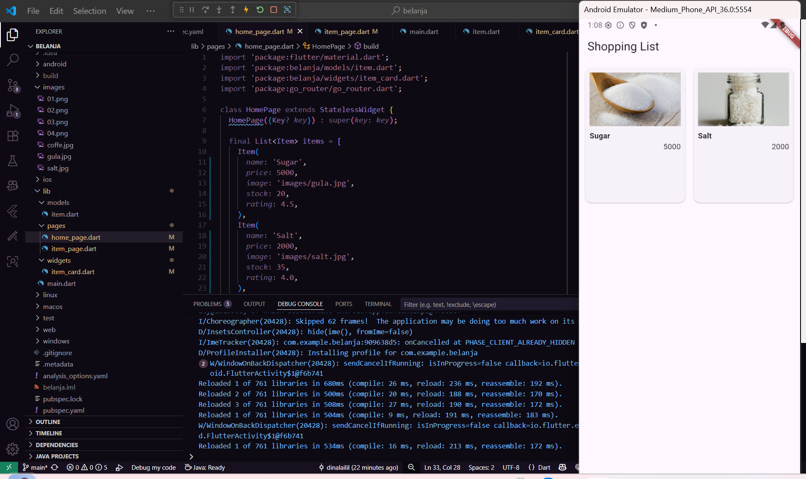
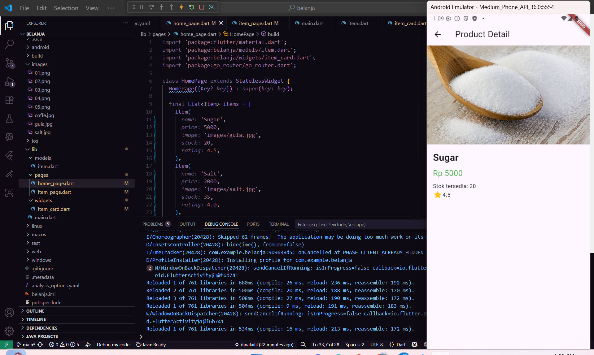

# belanja

A new Flutter project.

#Tugas praktikum fluuter 2 yang tugas 2

1. membuat project belanja

2. File ini berisi deklarasi class HomePage yang merupakan halaman utama aplikasi.
Pada halaman ini, ditampilkan daftar barang (item) menggunakan ListView.builder.

3. Halaman pertama (Shopping List) tampil list Sugar & Salt dengan harga.Jika ditekan salah satu item, akan pindah ke halaman detail dengan format Sugar with 5000.

#pakai plugin go_router
1a. Tanpa go_router: Navigasi pakai Navigator.push/pushNamed, route dikelola manual di MaterialApp. Cocok untuk aplikasi sederhana. contoh saya di home_page.dart
Dengan go_router: Navigasi lebih ringkas, terstruktur, mendukung named route, nested navigation, passing data, dan deep linking. Cocok untuk aplikasi kompleks.
contoh saya di home_page.dart
1b. Hero Widget memberikan pengalaman visual yang lebih menarik dan profesional saat navigasi antar halaman, sedangkan widget gambar biasa hanya menampilkan gambar tanpa animasi transisi.
contoh saya di item_page.dart

