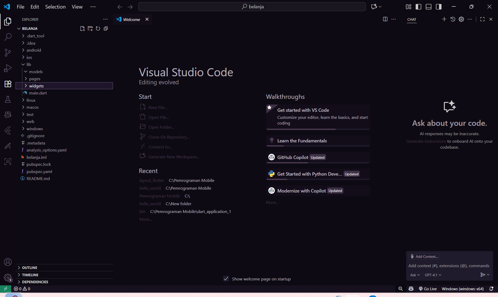
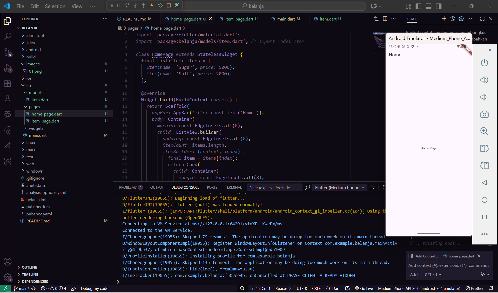
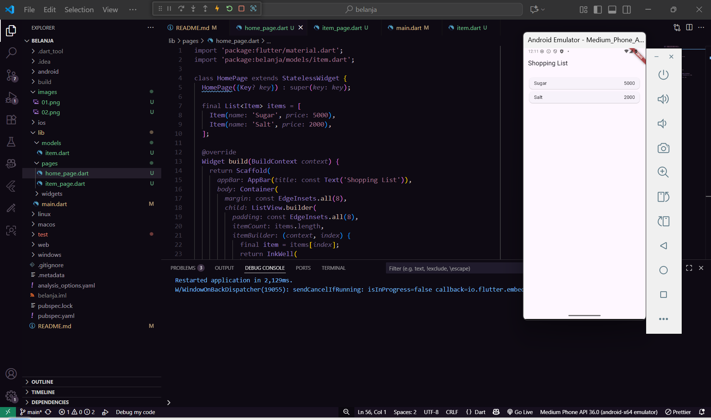
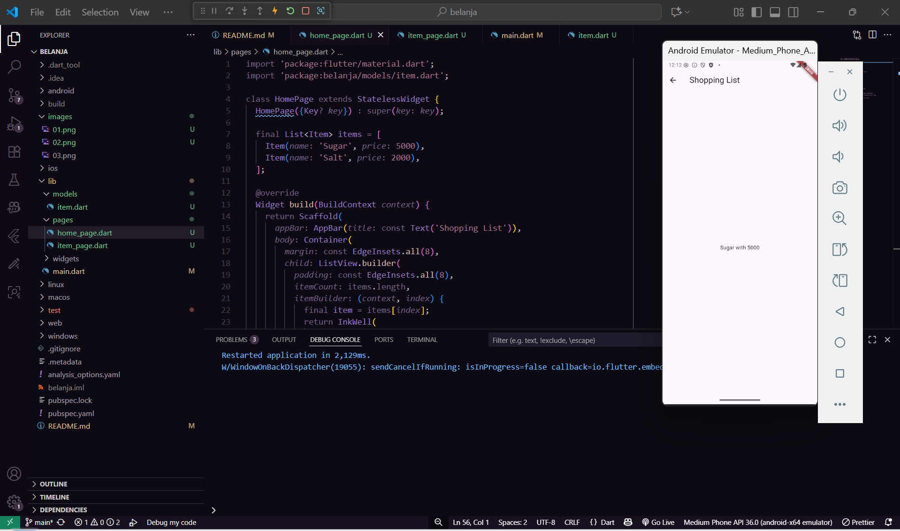

# belanja

A new Flutter project.

#Tugas praktikum fluuter 2 yang tugas 2

1. membuat project belanja

2. File ini berisi deklarasi class HomePage yang merupakan halaman utama aplikasi.
Pada halaman ini, ditampilkan daftar barang (item) menggunakan ListView.builder.

3. Halaman pertama (Shopping List) tampil list Sugar & Salt dengan harga.Jika ditekan salah satu item, akan pindah ke halaman detail dengan format Sugar with 5000.

